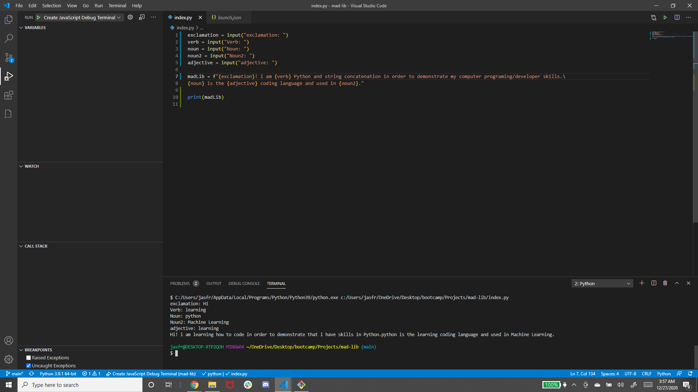
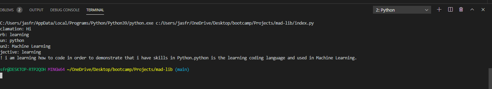

# Python Mad Lib
Create a mad lib game using python.

===========


===========


<br>

===========


## Demonstrate Use of Concatenation

```
madLib = f"{exclamation}! i am {verb} Python and string concatenation in order to demonstrate my computer programing/developer skills.\
{noun} is the {adjective} coding language and used in {noun2}."
```
<br>

## Feature Proper Use of Variables

```
exclamation = input("exclamation: ")
verb = input("Verb: ")
noun = input("Noun: ")
noun2 = input("Noun2: ")
adjective = input("adjective: ")
```
<br>

## Run Successful Code in Terminal

```
Verb: learning
Noun: python
Noun2: Machine Learning
adjective: learning
Hi! i am learning how to code in python in order to land a position in fin tech. Python is the learning coding language and used in Machine Learning.
```

## Built With

* [Python]
* [launch.json]
* [Javascript]
  


## Prerequisites

Python,
Git hub,
Git lab,
Git bash,
Visual studio,
Google chrome,
Bootstrap,
JavaScript

<br>

## Authors

**Jasmine Franklin: C: 301-332-2313 E: jasminer.franklin@gmail** 

- [Link to Portfolio Site](https://jas-f.github.io/responsive-portfolio/)
- [Link to Github](https://github.com/)
- [Link to LinkedIn](https://www.linkedin.com/in/jasmine-franklin-8b08ba121)
